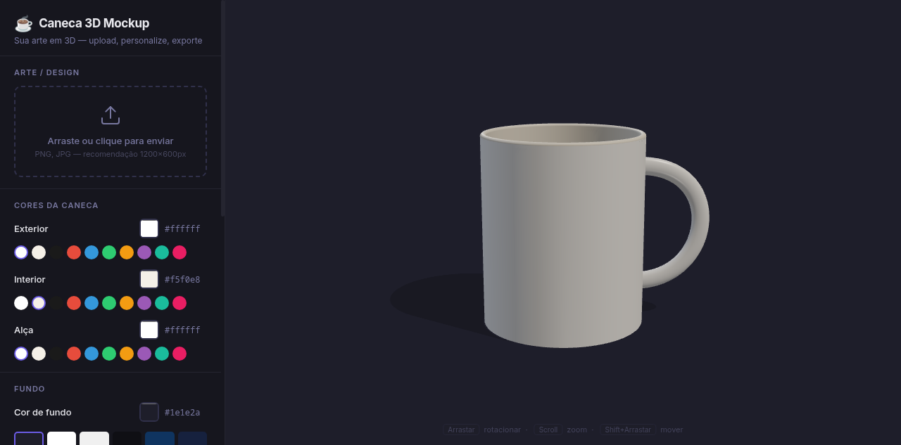

# 🎬 Caneca 3D Mockup

> Sua arte em 3D — upload, personalize, exporte



## O que é?

Ferramenta web interativa para criar mockups realistas de canecas 3D. Faça upload do seu design, escolha as cores, visualize em tempo real com rotação/zoom, e exporte vídeo + fotos para suas redes ou loja.

## Funcionalidades

- **Upload de arte** — PNG ou JPG (recomendação: 1200×600px)
- **Personalização de cores** — exterior, interior, alça e fundo
- **Visualização 3D interativa** — arraste para rotacionar, scroll para zoom
- **Exportação via API** — vídeo de 11s (rotação 360°) + 2 fotos estáticas

## Tech Stack

| Camada | Tecnologia |
|--------|-----------|
| Frontend | React + Three.js |
| Bundler | Vite |
| Backend | Express + Puppeteer |
| Renderização | Chrome headless + WebGL |
| Vídeo | FFmpeg (libx264) |

## Setup

```bash
# Instalar dependências
npm install

# Build do frontend
npm run build

# Iniciar servidor (porta 3003)
npm run server
```

Acesse `http://localhost:3003`

## API de Renderização

### POST `/api/render`

Envie uma imagem e receba vídeo + fotos da caneca renderizada.

```bash
curl -X POST http://localhost:3003/api/render \
  -F "artwork=@minha_arte.png" \
  -F "exterior=#1a1a2e" \
  -F "interior=#f5efe4" \
  -F "handle=#1a1a2e" \
  -F "background=#0f0f1a"
```

**Parâmetros:**

| Campo | Tipo | Default | Descrição |
|-------|------|---------|-----------|
| `artwork` | arquivo | obrigatório | Imagem para aplicar na caneca |
| `exterior` | string | `#ffffff` | Cor externa |
| `interior` | string | `#f5efe4` | Cor interna |
| `handle` | string | `#ffffff` | Cor da alça |
| `background` | string | `#1e1e2a` | Cor de fundo |
| `fps` | number | `30` | Frames por segundo |
| `duration` | number | `11` | Duração do vídeo (segundos) |
| `width` | number | `1080` | Largura em pixels |
| `height` | number | `1080` | Altura em pixels |

**Resposta:**

```json
{
  "jobId": "1234567890",
  "video": "http://localhost:3003/output/job_123/video_caneca.mp4",
  "fotoCentro": "http://localhost:3003/output/job_123/foto_centro.png",
  "fotoAlca": "http://localhost:3003/output/job_123/foto_alca.png"
}
```

### GET `/api/status`

Health check.

## Estrutura

```
MockupCaneca/
├── src/
│   ├── App.jsx              # Componente principal
│   ├── components/
│   │   ├── MugViewer.jsx    # Visualizador 3D (Three.js)
│   │   └── Sidebar.jsx      # Painel de controle
│   └── lib/
│       └── MugScene.js      # Cena 3D, materiais, iluminação
├── server.js                # API Express + Puppeteer
├── index.html
├── vite.config.js
└── package.json
```

## Licença

MIT
